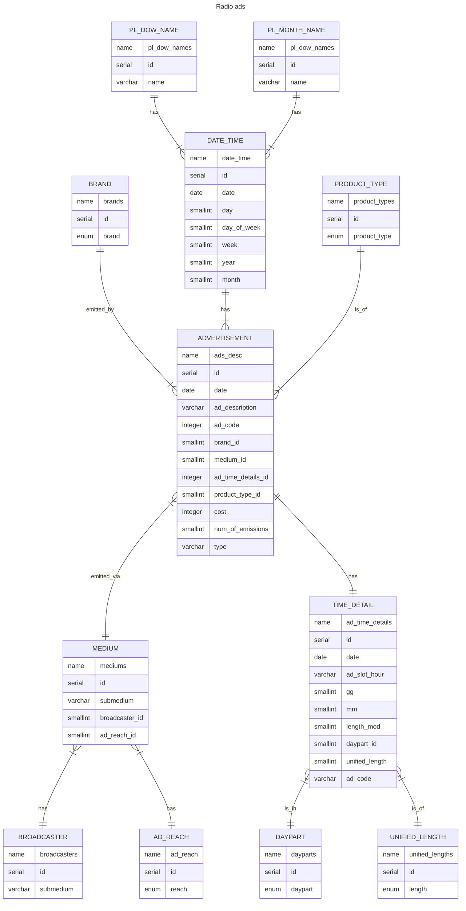

___
# Design Document

By Marcin Borowski

Video overview: <URL HERE>

## Scope

This database was designed for two purposes:

As a learning process of PostgreSQL which as a DBMS and a datatabase had been presented for a very brief time.

A place to store data about radio advertisements emitted by company I work for, and its competitors on Polish retail market. The data is currently being stored and accessed via Power Query from multiple excel files, and thus quite slow. The goal is to check if the transfer from excel files to this database will speed up the usage via Power Query and Pover Pivot. If not, another step is to switch completely to Jupyter and Pandas environment. 

* The database is going to store data gathered by the company conducting market surveys of radio advertisement.
* There are few main companies which own radio stations of various reach across Poland, and each radio station can broadcast radio ads.
* It *includes*, radio brand owners, radio brands, radio stations, brands instructing ads broadcasting, exact days, hours, dayparts, lengths, and simple transcriptions of ad contents.
* Contents of those ads also *includes* other brands and manufacturers of commodities.
* Out of scope are elements other than advertisements, and other retail branches in which company I work for doesn't conduct business.

## Functional Requirements

The database is going to help with:

* Storing the data of radio ads for given branch of Polish retail market.
* Providing updates of the data after each closed and reported month.
* Enabling data edition and correction.
* Creating of rapports, tables, charts, analysis etc.
* Reading the data to other environments such as Power Query, Pandas, Matplotlib, or simply providing tables in pure SQL queries.
* Conducting various data read duration tests.

The database won't: 

* manage data insertion by itself. For this purpose a api is needed to provide data, handle errors and table updates etc.
* In this version database can only store information about one specyfic branch of the Polish retail market. For handling more than one or other branches few modifications are needed.

## Representation
The data is being transfered into SQL tables as mentioned below. Two main tables are `ad_time_details` and `ads_desc`.

### Entities

In this section you should answer the following questions:

* Which entities will you choose to represent in your database?
* What attributes will those entities have?
* Why did you choose the types you did?
* Why did you choose the constraints you did?

#### <u>ads_desc</u>

The `ads_desc` table contains the data about the advertisement emission, their contents, type,, code, who instructed the broadcast, where it was broadcasted, ad emission time details, costs etc. The smallest unit of this table is one emission. Each row must have entries in all columns except one (`cost`), therefor `NOT NULL` constraints were added. Columns included in this table are:

- `id` which is the unique identification number for each ad emission, and by so has `PRIMARY KEY` constraint applied.
- `date` which states when given emission took place. Date is in ISO 8601 format and thus `DATE` available in PosgreSQL was used. In addition this is the column which relates to `date_time` table, thus `FOREIGN KEY` constraints were applied.
- `ad_description` which a simple transcript of the ad contents, thus `VARCHAR(200)` was used.
- `ad_code` which should be a unique numeric value of given advertisement. The type `INTEGER` was used here, because the schema of constructing this numeric value isn't known at this time. 
    > **NOTE!**
    > 
    > ADVERTISEMENT != EMISSION
    > The same advertisement can be emitted several times.
- `brand_id` which contains unique number that can be bound with brand instructing the emission (ad owner) table. Type used `SMALLINT`, and `FOREIGN KEY` restrictions were added.
- `medium_id` which contains unique number that can be bound with the owner od radio group or single radio station gathered in another table. Type used `SMALLINT`, and `FOREIGN KEY` restrictions were added.
- `ad_time_details_id` which contains unique number that can be bound with specific emission details in corresponding table. Those numbers **HAVE TO BE UNIQUE**, otherwise identification of single emissions won't be possible. Thus `UNIQUE` constraint was applied, and `FOREIGN KEY` as well. Type used for this column is `SMALLINT`.
- `product_type_id` which contains unique number that can be bound with product_types table. Thus type `SMALLINT` was used and `FOREIGN KEY` constraints applied.
- `cost` which represents the rate card cost of single emission. Best fit for rate card costs, being whole numbers is `INTEGER` type. This field can be empty. so no constraints was added.
- `num_of_emissions` is a number of ad emission. This value can't be a negative number, so `CHECK` was added, and `SMALLINT` type used.
- `type` which holds type of an add, thus `VARCHAR(50)` was used as a type, and a `DEFAULT` value set in case of missing data.

#### <u>ad_time_details</u>

The `ad_time_details` table, contains information about every ad emission hold  by the main table. Each row must have entries in all columns, therefor `NOT NULL` constraints were added. Columns included in this table are:

- `id` which is the unique identification number for each ad emission, and by so has `PRIMARY KEY` constraint applied.
- `date` which states when given emission took place. Date is in ISO 8601 format and thus `DATE` available in PosgreSQL was used. It's a helper column for better joins between tables.
- `ad_slot_hour` this is a range of 30 minutes in which advertising spots must be emitted. A brand instructing emission can choose how many and in which slot ads must appear. This is represented as text in GG:MM-GG:MM format, where the first part MM must be either 00 or 30, and the second 29 or 59 respectively. Thus `VARCHAR(11)` was used as a type.
- `gg` which is the exact hour of emission represented as a whole number, thus `SMALLINT` was used as type.
- `mm` which is the exact minute of emission represented as a whole number, thus `SMALLINT` was used as type.
- `length_mod` which is the exact duration in seconds of emission, represented as a whole number, thus `SMALLINT` was used as type.
- `daypart_id` which contains unique number that can be bound with dayparts table. Thus type `SMALLINT` was used and `FOREIGN KEY` constraints applied.
- `unified_length_id` which contains unique number that can be bound with unified lengths table. Thus type `SMALLINT` was used and `FOREIGN KEY` constraints applied.
- `ad_code` a unique string value made of date of emission, ad code, and index of a entry inputted into `ads_desc` table. This value is needed for the api in order to properly assign unique `id` to `ads_desc.ad_time_details_id` column. The similarity of column names (`ads_desc.ad_code` and `ad_time_details.ad_code`) is coincidental. Thus `VARCHAR(80)` was used as a type.

#### <u>rest of my tables...</u>

### Relationships

In this section you should include your entity relationship diagram and describe the relationships between the entities in your database.

ER DIAGRAM

## Optimizations

In this section you should answer the following questions:

* Which optimizations (e.g., indexes, views) did you create? Why?

## Limitations

In this section you should answer the following questions:

* What are the limitations of your design?
* What might your database not be able to represent very well?
