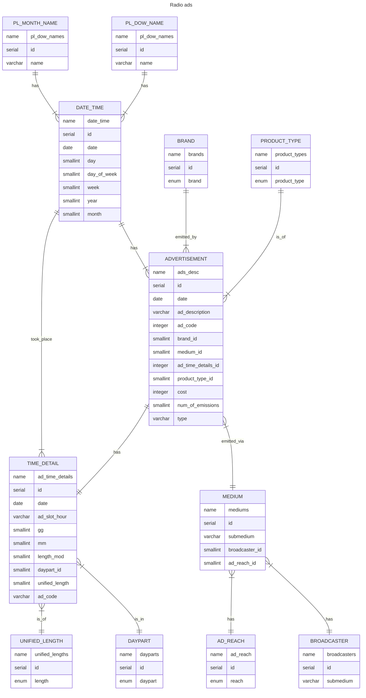

___
# Design Document

By Marcin Borowski

Video overview: [presentation](https://youtu.be/hTN8ylNZLOo)

GitHub repo: [repository](https://github.com/MrSz-84/cs50sql_fin)

 

## Scope

This database was designed for two purposes:

As a learning process of PostgreSQL which as a DBMS and a datatabase had been presented for a very brief time.

A place to store data about radio advertisements emitted by company I work for, and its competitors on Polish retail market. The data is currently being stored and accessed via Power Query from multiple excel files, and thus quite slow. The goal is to check if the transfer from excel files to this database will speed up the usage via Power Query and Pover Pivot. If not, another step is to switch completely to Jupyter and Pandas environment. 

* The database is going to store data gathered by the company conducting market surveys of radio advertisement.
* There are few main companies which own radio stations of various reach across Poland, and each radio station can broadcast radio ads.
* It *includes*, radio brand owners, radio brands, radio stations, brands instructing ads broadcasting, exact days, hours, dayparts, lengths, and simple transcriptions of ad contents.
* Contents of those ads also *includes* other brands and manufacturers of commodities.
* Out of scope are elements other than advertisements, and other retail branches in which company I work for doesn't conduct business.

 

> **NOTE**
>
> Code used in creation of functions and triggers is written using PostgreSQL syntax. Please keep this in mind. 
> It also can be fairly easily transformed into pure SQL.

 

## Functional Requirements

The database is going to help with:

* Storing the data of radio ads for given branch of Polish retail market.
* Providing updates of the data after each closed and reported month.
* Enabling data edition and correction.
* Creating of rapports, tables, charts, analysis etc.
* Reading the data to other environments such as Power Query, Pandas, Matplotlib, or simply providing tables in pure SQL queries.
* Conducting various data read duration tests.

The database won't: 

* manage data insertion by itself. For this purpose a API is needed to provide data, handle errors and table updates etc.
* In this version database can only store information about one specyfic branch of the Polish retail market. For handling more than one or other branches few modifications are needed.

## Representation
The data is being transfered into SQL tables as mentioned below. Two main tables are `ad_time_details` and `ads_desc`.

### Entities

#### <u>ads_desc</u>

The `ads_desc` table contains the data about the advertisement emission, their contents, type,, code, who instructed the broadcast, where it was broadcasted, ad emission time details, costs etc. The smallest unit of this table is one emission. Each row must have entries in all columns except one (`cost`), therefor `NOT NULL` constraints were added. Columns included in this table are:

- `id` which is the unique identification number of each ad emission, and by so has `PRIMARY KEY` constraint applied.
- `date` which states when given emission took place. Date is in ISO 8601 format and thus `DATE` available in PosgreSQL was used. In addition this is the column which relates to `date_time` table, thus `FOREIGN KEY` constraints were applied.
- `ad_description` which a simple transcript of the ad contents, thus `VARCHAR(200)` was used.
- `ad_code` which should be a unique numeric value of given advertisement. The type `INTEGER` was used here, because the schema of constructing this numeric value isn't known at this time. 

    > **NOTE!**
    > 
    > ADVERTISEMENT != EMISSION
    > The same advertisement can be emitted several times.

- `brand_id` which contains unique number that can be bound with brand instructing the emission (ad owner) table. Type used `SMALLINT`, and `FOREIGN KEY` restrictions were added.
- `medium_id` which contains unique number that can be bound with the owner od radio group or single radio station gathered in another table. Type used `SMALLINT`, and `FOREIGN KEY` restrictions were added.
- `ad_time_details_id` which contains unique number that can be bound with specific emission details in corresponding table. Those numbers **HAVE TO BE UNIQUE**, otherwise identification of single emissions won't be possible. Thus `UNIQUE` constraint was applied, and `FOREIGN KEY` as well. Type used for this column is `SMALLINT`.
- `product_type_id` which contains unique number that can be bound with product_types table. Thus type `SMALLINT` was used and `FOREIGN KEY` constraints applied.
- `cost` which represents the rate card cost of single emission. Best fit for rate card costs, being whole numbers is `INTEGER` type. This field can be empty. so no constraints was added.
- `num_of_emissions` is a number of ad emission. This value can't be a negative number, so `CHECK` was added, and `SMALLINT` type used.
- `type` which holds type of an add, thus `VARCHAR(50)` was used as a type, and a `DEFAULT` value set in case of missing data.

#### <u>ad_time_details</u>

The `ad_time_details` table, contains information about every ad emission hold  by the main table. Each row must have entries in all columns, therefor `NOT NULL` constraints were added. Columns included in this table are:

- `id` which is the unique identification number of each ad emission, and by so has `PRIMARY KEY` constraint applied.
- `date` which states when given emission took place. Date is in ISO 8601 format and thus `DATE` available in PosgreSQL was used. It's a helper column for better joins between tables.
- `ad_slot_hour` this is a range of 30 minutes in which advertising spots must be emitted. A brand instructing emission can choose how many and in which slot ads must appear. This is represented as text in GG:MM-GG:MM format, where the first part MM must be either 00 or 30, and the second 29 or 59 respectively. Thus `VARCHAR(11)` was used as a type.
- `gg` which is the exact hour of emission represented as a whole number, thus `SMALLINT` was used as type.
- `mm` which is the exact minute of emission represented as a whole number, thus `SMALLINT` was used as type.
- `length_mod` which is the exact duration in seconds of emission, represented as a whole number, thus `SMALLINT` was used as type.
- `daypart_id` which contains unique number that can be bound with dayparts table. Thus type `SMALLINT` was used and `FOREIGN KEY` constraints applied.
- `unified_length_id` which contains unique number that can be bound with unified lengths table. Thus type `SMALLINT` was used and `FOREIGN KEY` constraints applied.
- `ad_code` a unique string value made of date of emission, ad code, and index of a entry inputted into `ads_desc` table. This value is needed for the API in order to properly assign unique `id` to `ads_desc.ad_time_details_id` column. The similarity of column names (`ads_desc.ad_code` and `ad_time_details.ad_code`) is coincidental. Thus `VARCHAR(80)` was used as a type.

#### <u>date_time</u>

The `date_time` table contains information of each day at which emission of an ad took place. User should insert data only onto `date` column, and the database should complete the remaining columns.

 

>**NOTE**
>
>User can input data to other columns than `data` if it won't violate column constraints. Please look at the documentation below to familiarize yourself with what and where to input.

 

- `id` which is the unique identification number of each date, and by so has `PRIMARY KEY` constraint applied.
- `date` is inputted as ISO 8601 format (_YYYY-MM-DD_), and is formatted as `DATE` type. Inputted data also has to be unique, and not null, thus such constraints were used. 
- `day` represents the day of the month, `SMALLINT` type was used here. The database is going to add the data into this column automatically. Yet if the user wants to do it manually or via API, please keep in mind that `CHECK` constraint was applied. Only integer numbers between 1 and 31 are accepted.
- `day_of_week` represents a numeric value between 1 and 7 (1 for Monday, 7 for Sunday), thus `SMALLINT` type was applied, and a `CHECK` constraint. This column is also a `FOREIGN KEY` for `pl_dow_names` table. Field will be filled automatically.
- `week` represents the week number according to ISO 8601 format, which is achieved by ISODOW method of EXTRACT function. This column is of type `SMALLINT`, and `CHECK`s if inputted values are between 1 and 53. This column is populated automatically.
- `year` is of `SMALLINT` type represented as 4 digits. `CHECK` constraint accepts values between 1900 and 9999. The database takes care of data insertion to this column as well.
- `month` is represented as a whole number between 1 and 12. Thus the usage of `SMALLINT` type and `CHECK` constraint. This is also the `FOREIGN KEY` for `pl_month_names` table, and should be created automatically by the database itself.

 

> ***WARNING***
>
> Please note, that at this stage of development the DB does not check if any individual inserted values would indicate proper date according to the Gregorian calendar. If the user chooses to add data manually, they remain accountable of data validity. 

 

#### <u>pl_dow_names</u>

The `pl_dow_names` table contains information about Polish day of week names.

- `id` which is the unique identification number of each dow, and thus has `PRIMARY KEY` constraint applied.
- `dow_name` is the text representation of dow name, `ENUM` type was used, also `NOT NULL` and `UNIQUE` constraints.

#### <u>pl_month_names</u>

The `pl_dow_names` table contains information about Polish month names.

- `id` which is the unique identification number of each month, and thus has `PRIMARY KEY` constraint applied.
- `month_name` is the text representation of month name, `ENUM` type was used, also `NOT NULL` and `UNIQUE` constraints.

#### <u>brands</u>

The `brands` table contains information about the names of brands instructing advertisement to be broadcasted.

- `id` which is the unique identification number of each brand, and thus has `PRIMARY KEY` constraint applied.
- `brand` is the text representation of brand name, `ENUM` type was used, also `NOT NULL` and `UNIQUE` constraints.

#### <u>broadcasters</u>

The `broadcasters` table contains information about the names of parent companies names, who owns radio stations broadcasting ads instructed by brands.

- `id` which is the unique identification number of each broadcaster, and thus has `PRIMARY KEY` constraint applied.
- `broadcaster` is the text representation of radio group name, `VARCHAR(50)` type was used, also `NOT NULL` and `UNIQUE` constraints.

#### <u>ad_reach</u>

The `ad_reach` table contains information about the type of reach of a radio station.

- `id` which is the unique identification number of each type of reach, and thus has `PRIMARY KEY` constraint applied.
- `reach` is the text representation of reach type, `ENUM` type was used, also `NOT NULL` and `UNIQUE` constraints.

#### <u>mediums</u>

The `mediums` table contains information about the radio stations broadcasting instructed ads, their parent company and their reach. 

- `id` which is the unique identification number of each radio station, and thus has `PRIMARY KEY` constraint applied.
- `submedium` is the text representation of radio station's name, `VARCHAR(50)` type was used, also `NOT NULL` and `UNIQUE` constraints.
- `broadcaster_id` is the number equivalent of the parent company names. This is the `FOREIGN KEY` for `broadcaster` table, and as such it should be `NOT NULL`.
- `ad_read_id` is the number equivalent of the radio satation's reach. This is the `FOREIGN KEY` for `ad_reach_id` table, and as such it should be `NOT NULL`.

#### <u>dayparts</u>

The `dayparts` table contains information about the daypart in which given ad emission took place. In this database three values were used. 

- `id` which is the unique identification number of each daypart, and thus has `PRIMARY KEY` constraint applied.
- `daypart` is the text representation of daypart itself, `ENUM` type was used, also `NOT NULL` and `UNIQUE` constraints.

#### <u>unified_lengths</u>

The `unified_lengths` table contains information about the length of each ad emission. Every ad can vary in length, what makes analysis more challenging. Therefore lengths are classified into previously selected groups.

- `id` which is the unique identification number of each length od an ad, and thus has `PRIMARY KEY` constraint applied.
- `length` is the numeric representation of ad length, `ENUM` type was used, also `NOT NULL` and `UNIQUE` constraints.

#### <u>product_types</u>

The `product_types` table contains information about the type of a given advertisement. Pre-selected groups are being used here.

- `id` which is the unique identification number of each advertisement type, and thus has `PRIMARY KEY` constraint applied.
- `product_type` is the numeric representation of product type, `ENUM` type was used, also `NOT NULL` and `UNIQUE` constraints.

### Relationships

In the ER diagram below User can find the relationships between tables, as well the identification of each used column and its type. Mermaid for VSC was used for creation. See **[Marmaid](https://mermaid.js.org/)** website for more information.

#### **ER DIAGRAM**

Breaking down the ER diagram into words:

* In general this database is made around two main tables `ads_desc` and `ad_time_details` between there is one to on relationship. One ad has one set of unique time details. It is obvious that only one ad can be broadcasted at given time by given radio station. This is a design breakup of data, based on analytical experience, where not always the information about the ads themselves are needed for inferring insights.

* The rest is just a breakdown of individual elements such as dates, years, months, broadcasters, radio stations, dayparts emission hours etc. In theory this should save space when we are talking about over 13 million ads emitted, since 2017 which is the starting point of this data collection for the company I work for, and the numbers are still rising.

* There is a finite number of dow's, and each dow is represented either as a number or as text. One name, can be applied to many dates, but one date can be applied one and only one dow name. The same applies for months, and month names.

* The relationship between dates and emission or between dates and ad time details is one to many, because individual emission can be linked to only one date, but there can be more than one emission in given date.

* Brand instructing emissions of ads are in relation one to many. One brand can instruct the emission of many ads, but one emission of an ads can be linked to one brand. Also there is no possibility of emission only one ad, because the scale of those operations is too big. One ad emission won't get your information anywhere.

* One broadcaster (parent company) can own multiple radio stations (submediums), but one submediun, can be owned/be a part of one parent company and their product. Submediums can switch from one product/owner to another, but at given time there is no such possibility. This results in one to many relationship.

* One radio station (submedium) can have only one reach describing it. But many radio stations can be affiliated with one reach type. Thus one to many relationship can be observed.

* One radio station can broadcast many emissions of radio ads, but one emission can be connected to one and only one radio station (submedium).

* Daypart which is connected to ad time details is represented by one to many relationship. One daypart can be connected with many different emissions (information about time for individual emission), yet one emission can be broadcasted only in one daypart. 

* The same applies to the relationship between ad time details and unified lengths.

* Also each emission of an ad, can by of only one product type. Yet one product type can be linked to more than one ad, thus one to many relationship.

 

## Optimizations

Typical queries presented in `queries.sql` are going to use year and month filtering, therefor the database uses views as a tool for data partitioning. Smaller portion of data speed searches and data retrieving. 

Some of the typical queries are quite complex, thus views can significantly speed up the process of writing those queries.

By design data stored in the database are going to be accessed via Pandas library or Excel's Power Query, so it would be convenient to prepare a full join view of every column possible.

As for indexes, the most filtration is going to be done by brand, month, year and submedium. Therefore this should speed up searching and scanning.

 

## Limitations

As mentioned at the beginning, this database can't be used for storing multiple branches of radio advertisements due to its construction. If one would like to use it for that purpose, is should be extended by a column identification for market branch, in `brands`, `ad_time_details`, and `ads_desc` tables.
